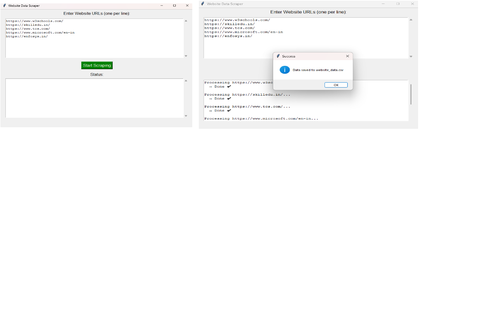

# 🌐 SafeSite Scraper

SafeSite Scraper is a Python-based GUI application that extracts useful information from websites and analyzes their credibility. It helps users gather contact details and detect potentially suspicious websites.

## 🚀 Features

- 🔍 Extract website title
- 📧 Find email addresses
- 📞 Extract phone numbers
- 🌐 Check website age using WHOIS
- ⚠️ Detect suspicious/spam websites
- 💻 Simple GUI using Tkinter
- 📁 Export data to CSV file

## 🛠️ Technologies Used

- Python
- Requests
- BeautifulSoup
- Pandas
- Tkinter (GUI)
- WHOIS

## 📌 How It Works

1. Enter one or more website URLs (one per line)
2. Click on **Start Scraping**
3. The tool will:
   - Fetch website data
   - Extract emails and phone numbers
   - Analyze domain age
   - Check for spam indicators
4. Results are saved in `website_data.csv`

## ▶️ How to Run

```bash
pip install requests beautifulsoup4 pandas python-whois
python app.py

## Author

Sandeep Aanjana

